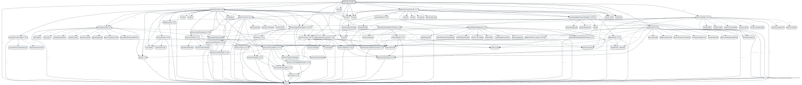

### Install

The recommended way to install this library is [through composer](http://getcomposer.org).
If you don't know yet what is composer, have a look [on introduction](http://getcomposer.org/doc/00-intro.md).

```bash
composer require bartlett/php-compatinfo
```


